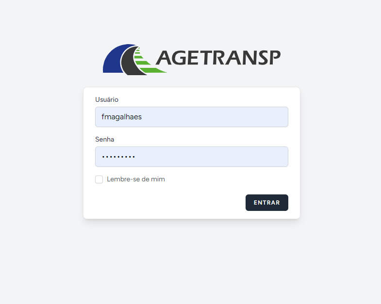

# Manual do usuário
<i>Esta documentação tem como objetivo orientar o usuário no modo de utilização do sistema intranet </i>
## Público alvo
Este manual se destina aos funcionários da AGETRANSP utilitários da <b>`intranet`</b>

## Credenciamento
Para acessar a <b>`intranet`</b> o usuário precisa ser um funcionário da AGETRANSP cadastrado no Active Directory, não há qualquer tipo de cadastramento via plataforma, a partir do momento que você tem suas credenciais institucionais <i>(usuário e senha que você utiliza no computador)</i>, você já é cadastrado na <b>`intranet`</b>.
 Para entrar no sistema, você preencherá os campos abaixo com as mesmas credenciais para logar no seu computador na AGETRANSP.

## Acesso
Através do site: http://sistemas.agetransp.local/entrar

## Funcionalidades
Para cada setor da AGETRANSP existem um conjunto de funcionalidades de interesse. Caso precise da explicação de uma funcionalidade em específico pesquise aqui na página por ela  <i>(aperte ctrl + f, e escreva o nome da funcionalidade na caixinha que aparecerá no seu browser)</i>

