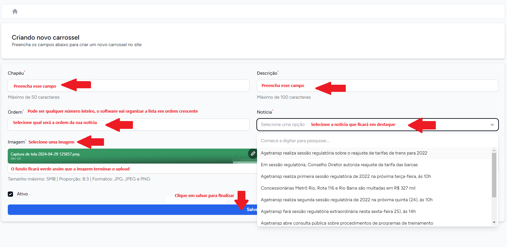

# Carrossel
O módulo carrossel foi desenvolvido para auxiliar funcionários da agência responsáveis pelo gerenciamento do carrossel de notícias no [site da AGETRANSP](http://www.agetransp.rj.gov.br/).
O objetivo da funcionalidade é criar uma área de destaque para as notícias, sem limite de notícias vinculadas dentro do carrossel.
><b>Obs:</b> Nem todos os usuários têm acesso a essa funcionalidade, o leque de funcionalidades dentro da `intranet` depende da sua área na empresa.

 
 A funcionalidade carrossel pode ser acessada no menu lateral esquerdo na opção <b>"Carrossel"</b>, assim como na figura abaixo.
 
 
 

## Listar itens de carrossel
Lista todas as notícias que estão em destaque no carrosel no site da AGETRANSP. Além da listagem, aparecerá diversas opções de gerenciamento dos itens de carrossel. A opção <b>"Listar"</b> estará acessível após o clique em <b>"Carrossel"</b>. Você vai se deparar com o seguinte <i>layout</i>.
 
 

 
 
Você pode reorganizar a lista, o que vai mudar a ordem de aparecimento dos itens de carrossel no [site da AGETRANSP](http://www.agetransp.rj.gov.br/).
 
 

 
 
Para o fazer, dentro do módulo **Carrossel** na `intranet` clique nas <b>"setinhas"</b> no gerenciamento de Carrosséis, como na imagem abaixo.
 
 

 
 
A listagem entrará em modo de edição e será possível reordená-las entre si, arraste uma notícia para cima ou para baixo para trocá-la de posição. Veja como reorganizá-las na imagem abaixo.
 
 

 
 

Além disso, para os itens de carrossel carrossel, é possível controlar se ele estará ativo ou não. Isso pode ser feito através desses 2 botões no canto direito da tela. Clique em <b>"ativar"/"desativar"</b> para ativar/desativar uma publicação no carrossel.
 
 

 
 
Rolando para direita, será possível a visualização de mais outras opções, sendo elas: <b>"Editar"</b> e <b>"Excluir"</b> que serão abordadas mais abaixo.
 
 

## Criar item de carrossel
Essa funcionalidade pode ser acessada a partir do menu lateral esquerdo, dentro do menu <b>"Carrossel"</b> como apresentado abaixo.
 
 

 
 
Ao clicar, você será direcionado para a página de criação de carrossel. Siga os passos abaixo para criação de um carrossel.
 
 

 
 

## Editar item de carrossel

Depois de criado um item pode ser editado, para editar, no gerenciamento de carrossel (página de listar carrosséis), clique em <b>"Editar"</b>.
 Você pode editar todos os campos de um item de carrossel: **"Chapéu"**, **"Descrição"**, **"Ordem"**, **"Notícia"** e **"Imagem"**.
 Esta página tem o seguinte *layout*:
 
 

 
 
### Alterando imagem
Ao clicar no *toggle* **"Alterar imagem"**, uma seção nova aparecerá para que o upload da imagem seja realizado.
 
 

## Deletar item de carrossel
Para deletar um item de carrossel vá até este item e navegue até a opção **"Deletar"**. Clique nesta opção e um *pop-up* de confirmação abrirá. Confirme para deletar. 