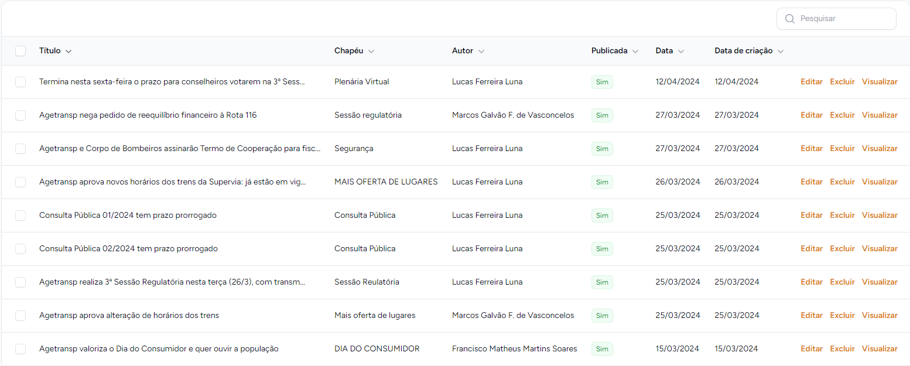
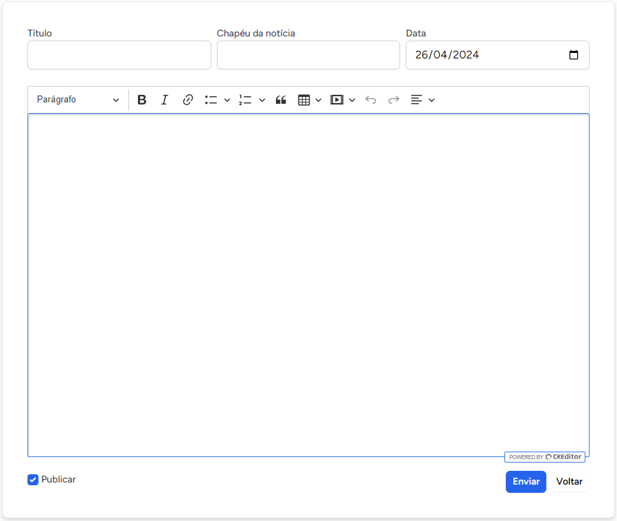
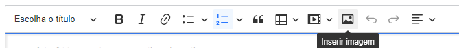
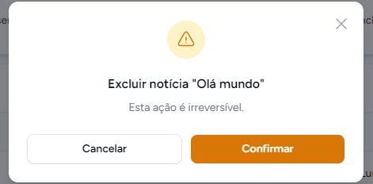

# Notícias
<i>Funcionalidades relacionadas a notícias </i>
 
 
O módulo de notícias dentro da intranet foi desenvolvido para auxiliar os funcionários responsáveis pela publicação de notícias, no [site da AGETRANSP](http://www.agetransp.rj.gov.br/)
><b>Obs:</b> Nem todos os usuários têm acesso a essa funcionalidade, o leque de funcionalidades dentro da `intranet` depende da sua área na empresa.

As notícias são acessadas no menu lateral à esquerda do browser, como na figura abaixo

## Listar notícias
Essa funcionalidade lista notícias cadastradas, ela pode ser acessada clicando em <b>Listar</b> abaixo da aba de <b>Notícias</b>
 Adicionalmente, podemos ordenar as notícias por <b>título</b>, <b>chapéu</b>, <b>autor</b>, <b>publicada</b>, <b>data</b> e <b>data de criação</b>
 Teremos o seguinte <i>layout</i> mostrado em tela:
 
## Criar notícia
Essa funcionalidade cria uma nova notícia, podendo ser acessada através da opção <b>Novo</b> na aba de <b>Notícias</b>.
Para criar uma notícia preechemos os campos <b>Título</b>, <b>Chapéu da notícia</b>, <b>Data</b> e finalmente preencher o espaço abaixo com o assunto da notícia propriamente dita.
 A imagem a seguir mostra a página com que você se deparará.
 
 

Além disso, o espaço onde a notícia será criada, conta com uma série de estilizações para que melhor se encaixe nas suas necessidades.
- As letras podem ser do tipo: Parágrafo, Título 1, Título 2 ou Título 3.
- Adicionalmente, podemos selecionar os estilos: <b>negrito</b>, <i>itálico</i> ou <b><i>os dois</i></b>
- Também é possível: a adição de links, criação de listas com marcadores ou numerais, criar bloco de citação, tabelas, inserção de links do <i>Youtube</i>, fazer e desfazer (ctrl+z e ctrl+y, respectivamente) e alinhar parágrafo.
- Para a inserção de imagens visite a seção [Editar notícia](#editar-noticia)
- Clique em <b>Enviar</b> para criar a notícia
## Editar notícia
Na listagem de notícias, vista na [figura](#listagem) mais acima, podemos clicar no botão de editar visto na margem direita de uma notícia, na listagem de notícias.
Podemos fazer tudo que se pode fazer ao criar uma notícia, porém, temos uma funcionalidade a mais que é a de adicionar uma imagem. Um novo botão aparecerá para este recurso conforme a imagem abaixo.
 
Após a edição da sua notícia clique em <b>Enviar</b> no canto inferior direito da sua tela.
## Excluir notícia
Na [listagem de notícias](#listagem), você também encontrará a opção de exclusão de notícia na margem direita de uma notícia.
Um pop-up surgirá para confirmação de exclusão. 
 

## Visualizar notícia
Também na margem direita de uma notícia na [listagem de notícias](#listagem) podemos visualizar uma das notícias cadastradas, clicando sobre <b>Visualizar</b> você é redirecionado para a notícia no [site da AGETRANSP](http://www.agetransp.rj.gov.br/) 
