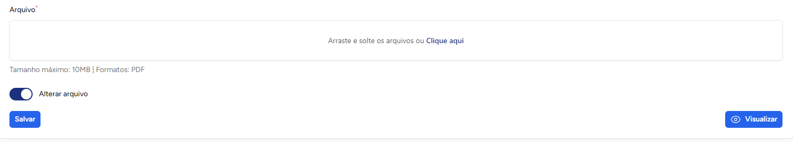
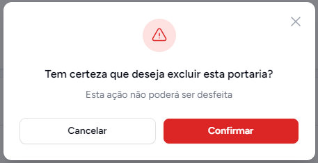

# Portarias

Portaria é um ato normativo interno que ministros e seus secretários emitem para estabelecer regras,
fornecer instruções sobre a aplicação das leis ou tratar da organização e funcionamento de serviços administrativos.
 Nesta módulo pode-se criar, editar, listar e deletar uma legislação que trata dos serviços concedidos regulados pela AGETRANSP e atos normativos expedidos pelo Conselho Diretor.
 As portarias criadas na `intranet` aparecem no [site da AGETRANSP](http://www.agetransp.rj.gov.br/)
 Para acessá-la faça como na figura abaixo

 

## Listar Portarias
> Aqui você pode visualizar e gerenciar todas as portarias cadastradas no sistema

Para acessar a funcionalidade, clique em **Portarias** no menu lateral esquerdo da sua tela

 
 

Você vai se deparar com a seguinte página 

 

Você pode ordenar e agrupar as portarias por <i>**Número**, **Data**, **Publicado no DOERJ em**, **Tags**, **Revogadas**</i> e se <i>**possuem arquivo**</i> ou não.
 À direita também podemos ver 2 botões funcionalidades [Editar](#editar-portaria) e [Excluir](#excluir-portaria). E um pouco mais a cima vemos um botão [Nova portaria](#criar-portaria)

## Criar Portaria
Para criar uma nova portaria clicamos no botão abaixo 

Após isso, seremos redirecionados para a página de criação de portaria, onde vamos preencher o formulário abaixo. 
Caso a portaria a ser criada altere uma portaria existente, selecione a portaria que sofrerá alteração no campo **Altera portaria**. 
O mesmo se aplica para **Revoga portarias**. Anexe um arquivo no campo **Arquivo**. Ao terminar clique em **Salvar**. 
 
 

## Editar Portaria 
Para editarmos uma portaria, na página principal de portarias, clicamos na opção **Editar** como na imagem abaixo
 
 
 
Então você será direcionado para um formulário parecido com o de [criar portaria](#criar-portaria). Além disso, você também pode 
alterar o arquivo da Portaria que deseja editar.
 Abaixo, a imagem ilustra o formulário e em destaque mostra aonde clicar para alterar um arquivo
 
 
 
Então uma nova seção aparecerá no formulário para que seja feita o upload do novo arquivo. Esta pode ser vista abaixo.
 

## Excluir Portaria
Para excluir uma portaria, na página principal de portarias, clicamos na opção **Excluir** como na imagem abaixo
 
 
 
Um pop-up de confirmação aparecerá. Clique em **Confirmar** para **excluir**.
 

