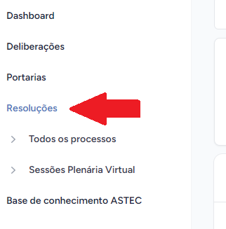
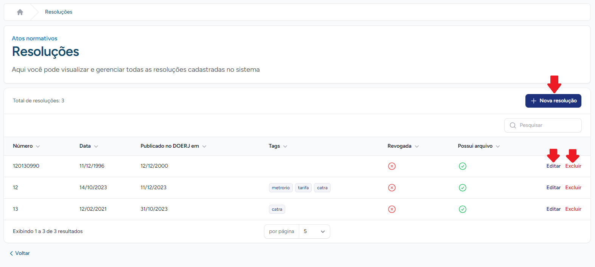

# Resoluções

A resolução é uma forma de extinção de contrato em que uma das partes declara à outra sua intenção de terminar o acordo devido ao descumprimento das obrigações contratuais.
As resoluções da AGETRANSP podem ser encontradas [aqui](http://www.agetransp.rj.gov.br/transparencia/resolucoes).
 Neste módulo, encontramos funcionalidades para criar, visualizar, editar e excluir resoluções
 
 Este pode ser encontrado no seu menu lateral esquerdo, como a figura abaixo
 
>Obs.: As resoluções são criadas na nossa plataforma `intranet` e da nossa plataforma ela vai para o [site da AGETRANSP](http://www.agetransp.rj.gov.br/)

## Listar Resoluções

Após o clique no menu lateral esquerdo, você se deparará com a seguinte página, onde todas as resoluções estarão listadas, sendo possível também visualizar outras funcionalidades como, [criar nova resolução](#criar-resolucao), [editar resolução](#editar-resolucao) e por fim [excluir resolucao](#excluir-resolucao).
 A página em questão pode ser vista abaixo, com as funcionalidades a cima destacadas na imagem.
 

## Criar Resolução

Para criarmos uma resolução clique no botão escrito **"+ Nova resolução"** na página principal de resoluções. Você será redirecionado para página de criação de nova resolução. 
 Preencha o formulário abaixo para criar uma nova resolução